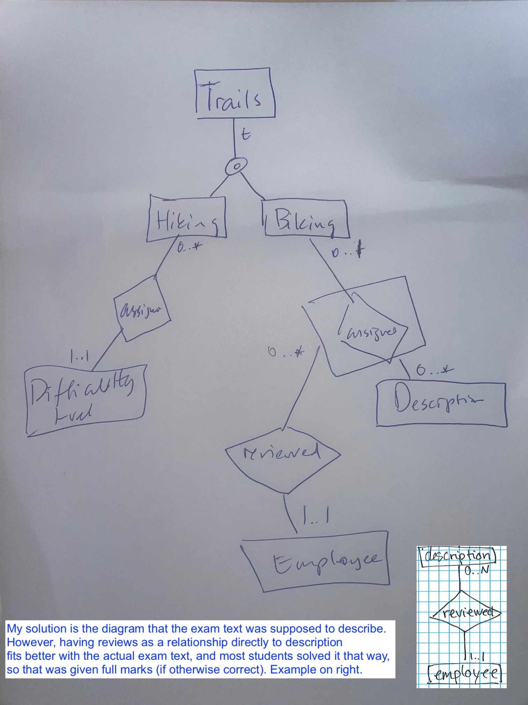
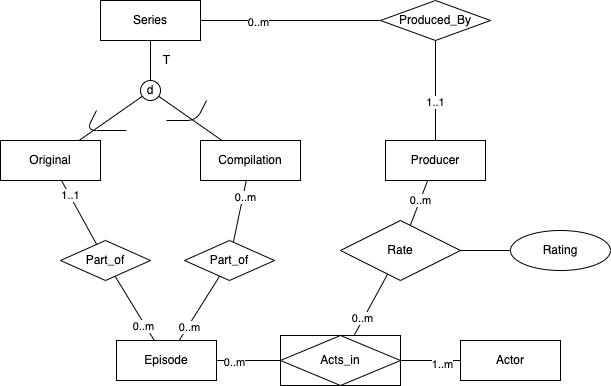
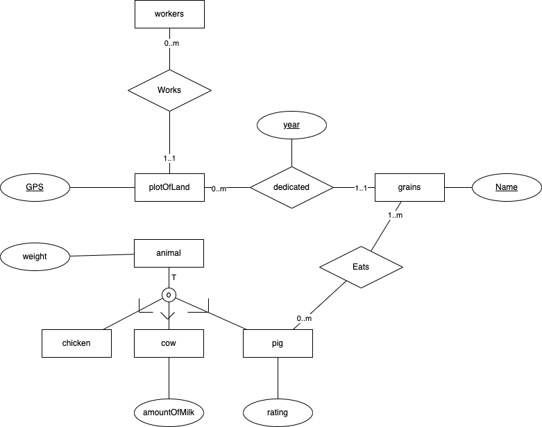
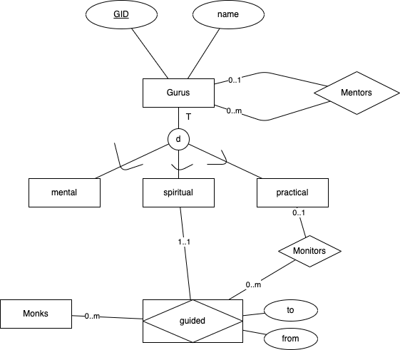
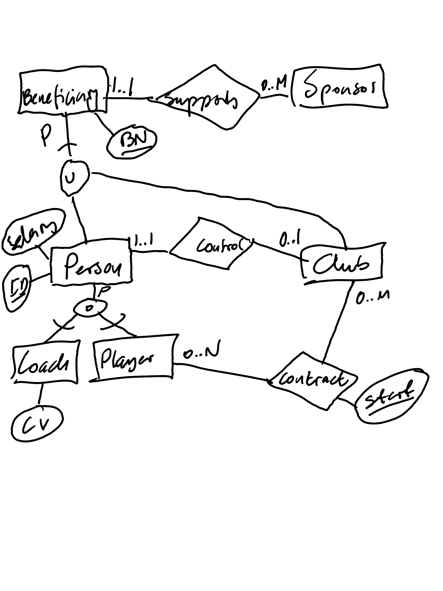
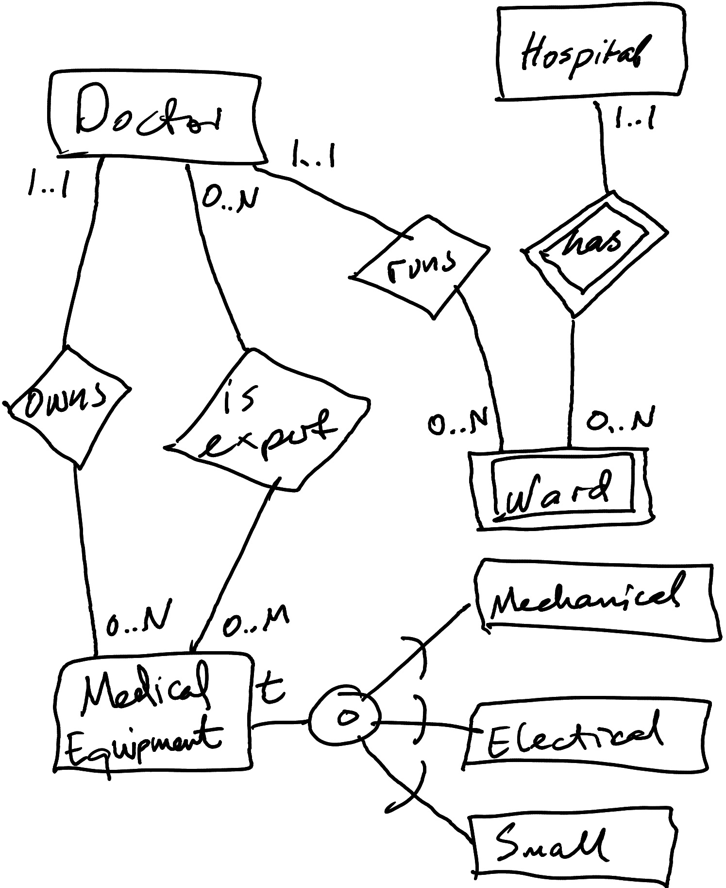
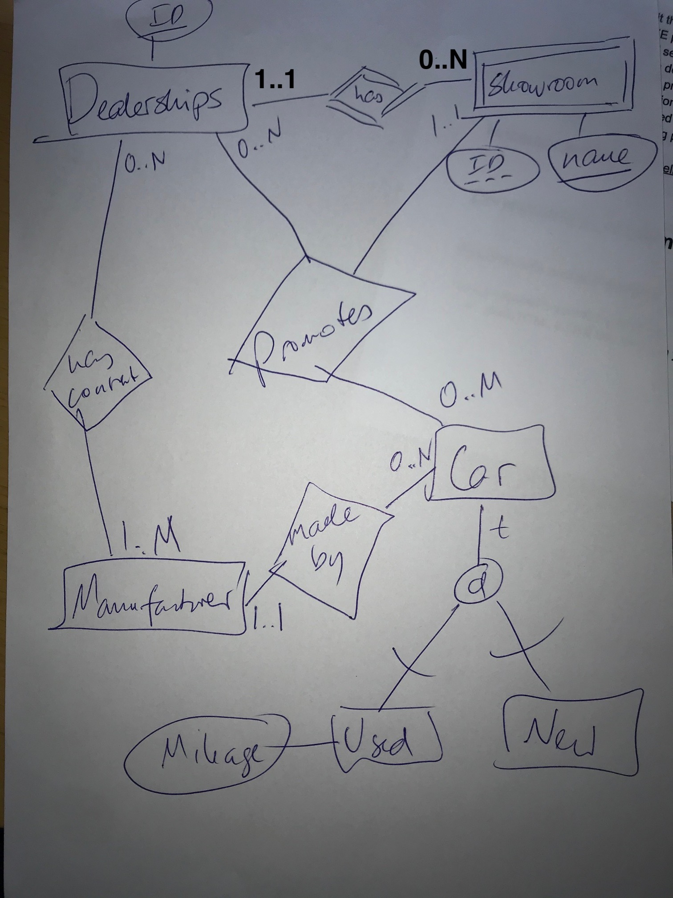
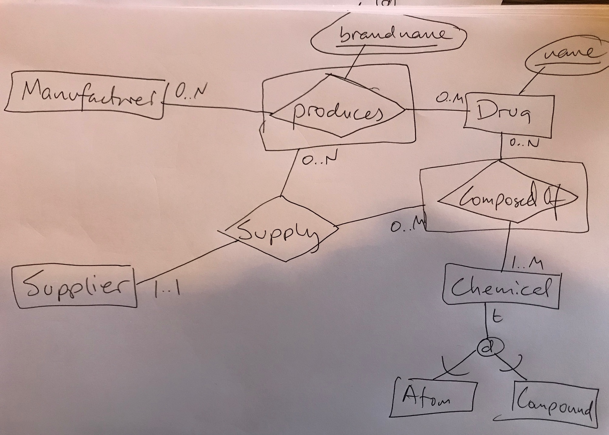
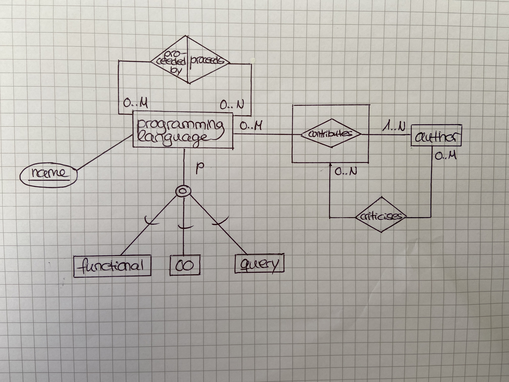

# Drawing, ER-diagrams

[All Answers](../All_Answers.md)

## August 2022

**c) Write an ER diagram for a database of trails based on the following requirements. The diagram should clearly show the entities, relationships and participation constrains described below. You should not include any attributes in your design. Use the notation presented in the textbook and lectures.**

- Trails are hiking trails or biking trails, and some trails may be both.

- Hiking trails are assigned one difficulty level.

- Biking trails can have multiple descriptions. Each description applies to at most one trail.

- Each description is reviewed by one employee.

## Maj 2022

**c) Write an ER diagram for a database of vehicles based on the following requirements. The diagram should clearly show the entities, relationships and participation constrains described below. You should not include any attributes in your design. Use the notation presented in the textbook and lectures. If you need to make additional assumptions put them in the box below.**

- Vehicles may be boats or cars, but not both.
- Humans must own exactly one car.
- Humans can sell boats to other humans.
- Each such sale may be reviewed by one human.

## December 2021

**c) Write an ER diagram for a database of television series based on the following requirements. The diagram should clearly show the entities, attributes, relationships and participation constrains described below. Use the notation presented in the textbook and lectures. Attributes are only important if mentioned. If you need to make additional assumptions put them in the box below.**

- Series are either Original or Compilation, not both. Each type has multiple attributes, but you can ignore them in your design.
- Each series is produced by one Producer.
- Each episode is part of one Original series.
- Episodes can also be part of many Compilation series.
- Actors can act in multiple episodes. Each episode has at least one actor.
- Producers rate the acting of actors in individual episodes, with a rating attribute.

## June 2021

**c) Write an ER diagram for a farm database, based on the following requirements. The diagram should clearly show the entities, relationships, participation constraints and keys described in the text. Attributes are only important if they are mentioned in this description; you should not add other attributes. Follow precisely the notation presented in the textbook and lectures.**

- Each farm animal is one of pig, cow or chicken. All animals have weight, cows have yield (i.e., amount of milk), and pigs have a rating. ˆ
- Each plot of land has a (unique) identifer and GPS location (for simplicity, model this as a single attribute). ˆ
- Different grains are identi ed by their name. ˆ
- A plot is dedicated to exactly one grain every year; this grain varies across years. ˆ
- Each pig must eat some of the grains. ˆ
- Workers are hired to work on one specific plot of land.

## August 2021

**c) Write an ER diagram for a guru database, based on the following requirements. The diagram should clearly show the entities, relationships, participation constraints and keys described in the text. Attributes are only important if they are mentioned in this description; you should not add other attributes. Follow precisely the notation presented in the textbook and lectures.**

- Gurus have a unique identifier, and a name.
- Gurus are of one of the following types: mental, spiritual or practical. (For each type, there are many attributes, but you can ignore these.)
- Each guru may be mentored by one other guru. (Type is irrelevant here.)
- Monks are guided by one spiritual guru at each time. The time interval (to, from) of guidance must be recorded, and monks may be guided by the same guru more than once.
- Each guidance interval may be monitored by one practical guru.

## March 2021

**c) Write an ER diagram for a database for a sports league. The diagram should clearly show the entities, relationships and participation constrains described below. Attributes are only important if they are mentioned in this description; you should not add other attributes. Follow precisely the notation presented in the textbook and lectures.**

- A person may be either a coach or a player, or even both. Each person has ID and salary. Each coach has a CV. ˆ

- A player may have a contract with multiple clubs. If a player has multiple contracts with the same club, they must start on different days. ˆ

- Each club is controlled by one person; each person can at most control one club. ˆ

- Both clubs and people can be beneficiaries (here, a beneficiaries is an entity that can accept sponsorships). Each beneficiary has a unique BN (short for beneficiary number). ˆ

- Each sponsor supports one beneficiary.

## January 2021

**c) Write an ER diagram for a medical equipment database for a hospital chain. The diagram should clearly show the entities, relationships and participation constrains described below. Attributes are only important if they are mentioned in this description; you should not add other attributes. Follow precisely the notation presented in the textbook and lectures.**

- Each piece of medical equipment is of one (or more) of three di erent types: electrical; mechanical; or small.
- Each hospital in the chain has multiple wards; each ward has a unique number only within its hospital.
- One doctor runs each hospital ward.
- Doctors may have expertise in some pieces of medical equipment.
- Each piece of medical equipment is owned by one doctor.

## August 2020

**c) Write an ER diagram for a car sales database. The diagram should clearly show the entities, relationships and participation constrains described below. Attributes are only important if they are mentioned in this description; you should not add other attributes. Follow precisely the notation presented in the textbook and lectures.** ˆ

- Dealerships are identified by a unique ID. ˆ
- Each dealership has multiple showrooms, which are identified with a name. Car dealers are not very creative, so many of them simply name their showrooms using single letters, e.g., ‘A’ and ‘B’.
- Each dealerships has a contract with at least one manufacturer. ˆ
- Each car is made by exactly one manufacturer. ˆ
- Each car is either new or used. For used cars, the mileage is registered. ˆ
- Dealerships can promote any car, regardless of manufacturer, but they can only promote each car in one showroom.

## April 2020

c) Write an ER diagram for a drug database. The diagram should clearly show the entities, relationships and participation constrains described below. Attributes are only important if they are mentioned in this description; you should not add other attributes. Follow precisely the notation presented in the textbook and lectures.

- A drug has a unique generic name.
- Drugs may be produced by multiple manufacturers, and each manufacturer may produce the same drug using multiple di erent brand names.
- A chemical is either an atom or a compound, not both.
- A drug is composed of at least one chemical.
- Suppliers supply chemicals for the production of drugs, with these constraints:
- Each brand-name drug production uses exactly one supplier for each chemical.
- We must ensure that the chemicals used for the brand-name production are actually required for the drug.

## May 2020

**c) Write an ER diagram for a programming language database. The diagram should clearly show the entities, relationships and participation constrains described below. Attributes are only important if they are mentioned in this description; you should not add other attributes. Follow precisely the notation presented in the textbook and lectures.**

- A programming language has a unique name.
- Programming languages are divided into functional, OO and query languages. Some may be of more than one sub-type and some may be of none.
- Programming languages may have multiple predecessors.
- Authors may have contributed to many languages, but languages must have at least one contributing author.
- Author sometimes criticise the contributions of authors to a particular programming language (sometimes they even criticise themselves, although this is not relevant for the ER diagram).

