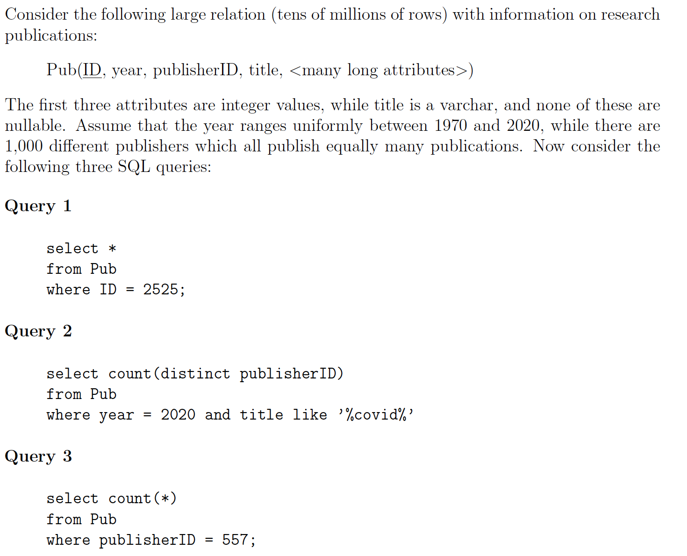
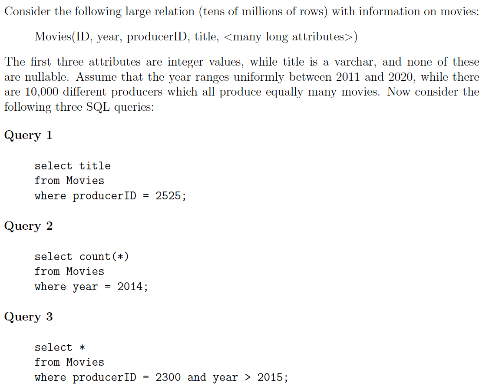
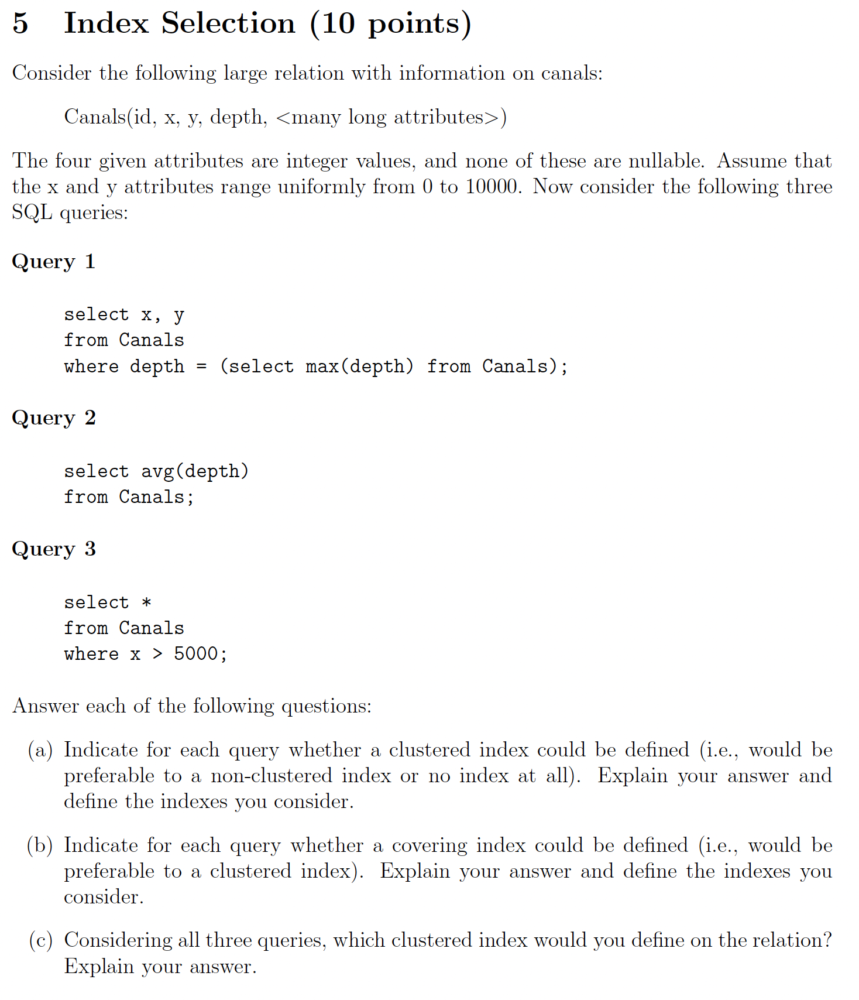
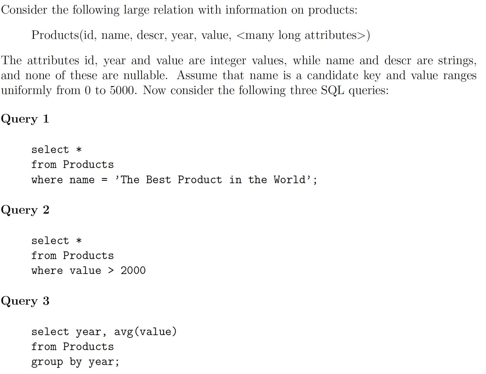
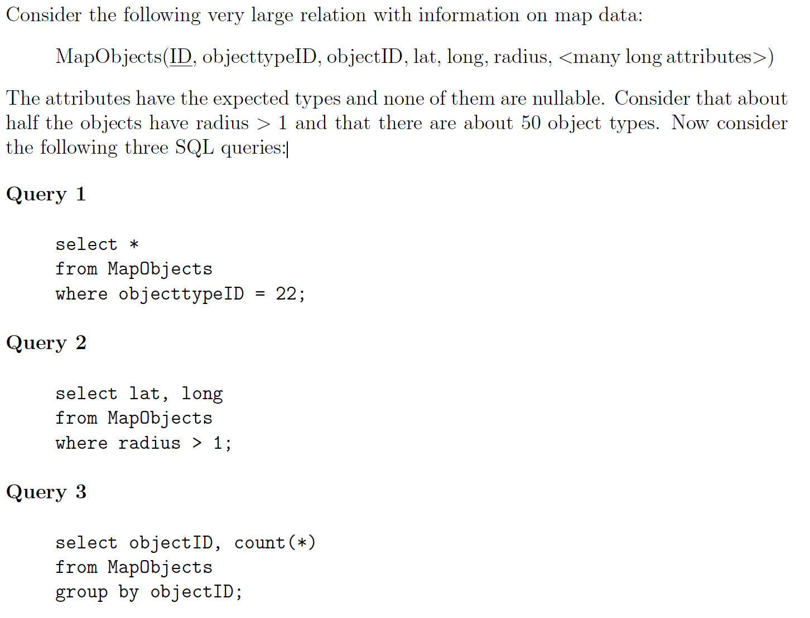
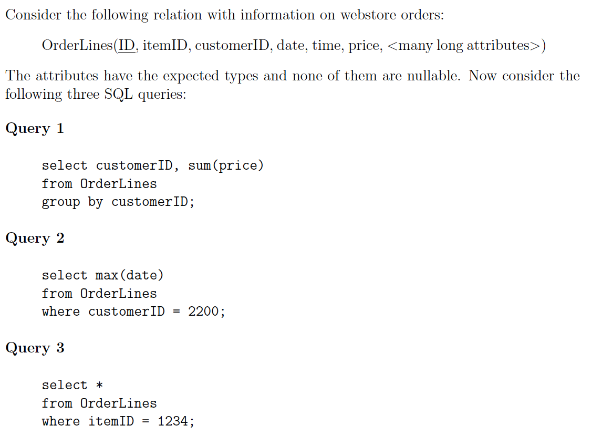
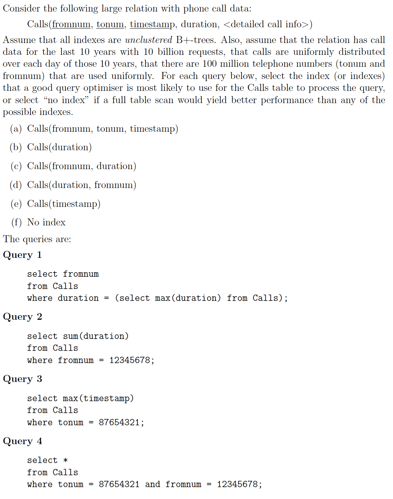
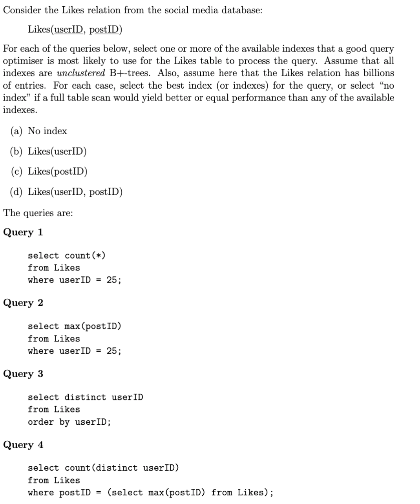
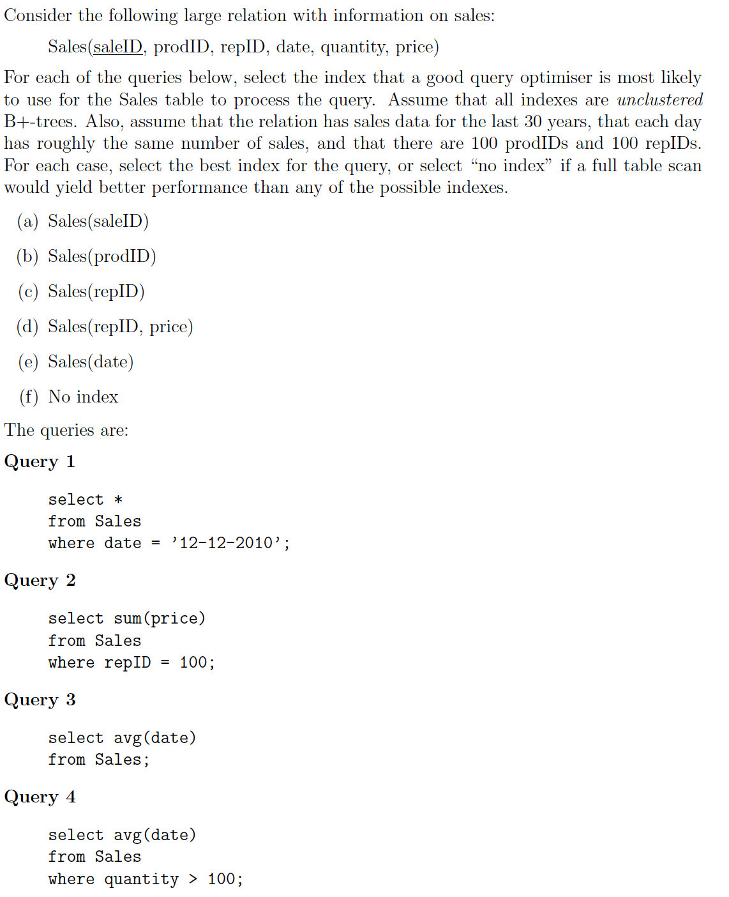
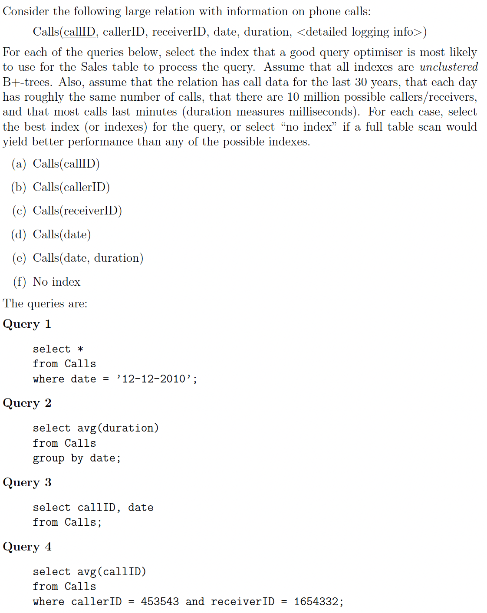

# Index Selection

[All Answers](../All_Answers.md)

## August 2022

(a) Indicate for each query whether a clustered index would be preferable to a nonclustered index or no index at all. Explain your answer and define the indexes you consider.

- (Q1) Since the ID is unique, a clustered index on ID will perform exactly the same as an unclustered index. Both will be much faster than no index.
- (Q2) This query has one equality constraint that will return about 2% of the relation, while the constraint on title cannot be indexes. A clustered index on year will thus require about 2% of the time that a full scan (no index) will require, while an unclustered index would be even slower.
- (Q3) A clustered index on publisherID would perform very well and read only 0.1% of the relation. As it turns out, however, such an index is covering and thus an unclustered index on publisherID would perform equally well.

(b) Indicate for each query whether a covering index would be preferable to a clustered index. Explain your answer and define the indexes you consider.

- (Q1) A covering index does not apply here, since the entire record is returned.
- (Q2) An index on (year, title, publisherID) would technically be covering and optimal, but systems are unlikely to use such an index.
- (Q3) Any index on year would be covering and optimal.

(c) Considering all three queries, which single clustered index would you define on the relation? Explain your answer.

- Since Q1 is well served by an unclustered index and Q3 is well served by a covering index, a clustered index on (year) would be the logical choice for these queries.

## Maj 2022

(a) Indicate for each query whether a clustered index would be preferable to a nonclustered index or no index at all. Explain your answer and define the indexes you consider.

- (Q1) Since there are about 10K producers, this query will return a small proportion of the relation. A clustered index on producerID will be more effective than an unclustered index on producerID, and much more effective than a full table scan.
- (Q2) This query will count about 10% of the relation, but return only one row. Any index on year will be covering, and therefore much more efficient than a full table scan. A clustered index will perform the same as an unclustered index in this case, however.
- (Q3) A clustered index on producerID would perform very well, but a clustered index on (producerID, year) would perform even better. Both would perform better than a full table scan or an unclustered index.

(b) Indicate for each query whether a covering index would be preferable to a clustered index. Explain your answer and define the indexes you consider.

- (Q1) An index on (producerID, title) would be covering and optimal, as it would read less data than an unclustered index.
- (Q2) Any index on year would be covering and optimal.
- (Q3) A covering index does not apply here.

(c) Considering all three queries, which single clustered index would you define on the relation? Explain your answer.

- Since Q1 and Q2 are well served by a covering index, while Q3 is not, a clustered index on (producerID, year) would be optimal for these three queries. Note that if a covering index on (producerID, title) does not exist, this clustered index is also very effective for Q1.

## March 2022

5a) Argue for a clustered index for each query, compared to unclustered or no index.

- (Q1) Any index on depth would be covering for the subquery, and should work well for the outer query as well. If more than a small portion of the canals is of the maximum depth, then a clustered index would be useful.
- (Q2) An index on depth will be covering, so a clustered index would perform the same as an unclustered.
- (Q3) A clustered index on x would improve performance by 50% over a full scan, and perform much better than an unclustered index.

5b) Argue for a covering index for each query, compared to clustered index.

- (Q1) For the outer query, a covering index on (depth, x, y) would outperform an index on depth alone.
- (Q2) Any index on depth would be covering and optimal.
- (Q3) Since whole rows are returned, covering indexes don’t apply here.

5c) Considering all three queries, explain which clustered index would you define.

- Since Q1 and Q2 are well served by covering index, while Q3 is not, a clustered index on x would be optimal for these three queries.

## December 2021

(a) Indicate for each query whether a clustered index should be defined (i.e., would be preferable to a non-clustered index or no index at all). Explain your answer and define the indexes you consider.

- (Q1) Since this query retrieves exactly one record, (a) an index on name will be better than no index, but (b) an unclustered index will perform as well as a clustered index.
- (Q2) A clustered index on value will perform well. Since the query returns about 60% of the relation, it will perform about 40% better than a full table scan, and much better than an unclustered index.
- (Q3) A clustered index on year would allow to answer the query with a single sequential scan. An unclustered index would perform worse (more IOs, plus random IOs), while no index would result in sorting or hashing.

(b) Indicate for each query whether a covering index could be defined (i.e., would be preferable to a clustered index). Explain your answer and define the indexes you consider.

- (Q1/Q2) Since whole rows are returned, covering indexes don’t apply here.
- (Q3) A covering index on year and value would allow reading much less data than using the clustered index, even if the number of rows is the same, and hence it is optimal.

(c) Considering all three queries, which clustered index would you define on Products? Explain your answer.

- While Q2 and Q3 could both benefit from a clustered index, query Q3 would be even better with a covering index, while the clustered index is optimal for Q2. Hence a clustered index on value would be optimal.

## August 2021

**(a) Indicate for each query (in isolation) whether a clustered index could be pro tably de ned (i.e., would be preferable to a non-clustered index or no index at all). Explain your answer and de ne the indexes you consider.**

- (Q1) With 50 object types, this query could return 2% of the relation. Thus a clustered index on (objecttypeID) would be much preferable to an unclustered index or no index.
- (Q2) Returning about half the relation, a clustered index on (radius) would be much preferable to an unclustered index or no index.
- (Q3) Since grouping can be implemented by sorting, a clustered index on (objectID) would be significantly faster than no index. Since the query only requires the objectID attribute, however, an unclustered index on (objectID) would be covering, and hence faster than a clustered index.

**(b) Indicate for each query (in isolation) whether a covering index could be profietably defined (i.e., would be preferable to a clustered index). Explain your answer and de ne the indexes you consider.**

- (Q1) A covering index does not apply here, since all attributes are returned.
- (Q2) A covering index on (radius, lat, long) would be optimal, as it reads fewer columns than a clustered index.
- (Q3) A covering index on (objectID) is optimal, as it can be scanned once and the query result computed directly.

**(c) Recall that a relation can only have one clustered index. Considering all three queries, which clustered index would you de ne on the relation? Explain your answer.**

- Since covering indexes can be used effectively for queries Q2 and Q3, but not for Q1, the best clustered index for these three queries would be on (objecttypeID).

## June 2021

(a) Indicate for each query (in isolation) whether a clustered index could be profitably defined (i.e., would be preferable to a non-clustered index or no index at all). Explain your answer and define the indexes you consider.

- (Q1) To run the GROUP BY, a system would typically sort the relation. An index can be used to read the relation in a sorted order. A clustered index on (customerID) would perform better than an unclustered index or no index. Since an unclustered index on (customerID, price) would be covering, then a clustered index on (customerID, price) would not be better. ˆ
- (Q2) A clustered index on (customerID) would perform better than an unclustered index (unless each customer has one or very few orders) and no index (this is always worse). Since an unclustered index (customerID, date) would be covering, then a clustered index on (customerID, date) would not be better. ˆ
- (Q3) A clustered index on (itemID) would be optimal for this query, since (a) it outperforms no index, (b) it outperforms an unclustered index, and (c) covering indexes don't really apply.

(b) Indicate for each query (in isolation) whether a covering index could be profitably defined (i.e., would be preferable to a clustered index). Explain your answer and define the indexes you consider.

- (Q1) A covering index on (customerID, price) would perform optimally, by reading the minimal number of columns, while avoiding a sort of the relation.
- (Q2) Likewise, a covering index on (customerID, date) would be optimal, as it reads fewer columns than a clustered index.
- (Q3) A covering index does not apply here, since all attributes are returned.

(c) Recall that a relation can only have one clustered index. Considering all three queries, which clustered index would you defne on the relation? Explain your answer.

- Since covering indexes can be used effectively for queries Q1 and Q2, but not for Q3, the best clustered index for these three queries would be on (itemID).

## March 2021

**5a) Selection for Query 1:**

(a) Calls(fromnum, tonum, timestamp) (0%)

(b) Calls(duration) (50%)

(c) Calls(fromnum, duration) (0%)

(d) Calls(duration, fromnum) (50%)

(e) Calls(timestamp) (0%)

(f) No index (0%)

**5b) Selection for Query 2:**

(a) Calls(fromnum, tonum, timestamp) (0%)

(b) Calls(duration) (0%)

(c) Calls(fromnum, duration) (100%)

(d) Calls(duration, fromnum) (0%)

(e) Calls(timestamp) (0%)

(f) No index (0%)

**5c) Selection for Query 3:**

(a) Calls(fromnum, tonum, timestamp) (0%)

(b) Calls(duration) (0%)

(c) Calls(fromnum, duration) (0%)

(d) Calls(duration, fromnum) (0%)

(e) Calls(timestamp) (0%)

(f) No index (100%)

**5d) Selection for Query 4:**

(a) Calls(fromnum, tonum, timestamp) (100%)

(b) Calls(duration) (0%)

(c) Calls(fromnum, duration) (0%)

(d) Calls(duration, fromnum) (0%)

(e) Calls(timestamp) (0%)

(f) No index (0%)

## January 2021

**5a) Selection for Query 1:**

(a) Requests(ID) (0%)

(b) Requests(userID) (0%)

(c) Requests(baseURL) (0%)

(d) Requests(timestamp) (0%)

(e) Requests(userID, timestamp, ID) (0%)

(f) No index (100%)

**5b) Selection for Query 2:**

(a) Requests(ID) (100%)

(b) Requests(userID) (0%)

(c) Requests(baseURL) (0%)

(d) Requests(timestamp) (0%)

(e) Requests(userID, timestamp, ID) (0%)

(f) No index (0%)

**5c) Selection for Query 3:**

(a) Requests(ID) (0%)

(b) Requests(userID) (0%)

(c) Requests(baseURL) (0%)

(d) Requests(timestamp) (0%)

(e) Requests(userID, timestamp, ID) (100%)

(f) No index (0%)

**5d) Selection for Query 4:**

(a) Requests(ID) (0%)

(b) Requests(userID) (0%)

(c) Requests(baseURL) (0%)

(d) Requests(timestamp) (0%)

(e) Requests(userID, timestamp, ID) (0%)

(f) No index (100%)

## August 2020

**5a) Selection for Query 1:**

(a) No index (0%)

(b) Likes(userID) (100%)

(c) Likes(postID) (0%)

(d) Likes(userID, postID) (0%)

**5b) Selection for Query 2:**

(a) No index (0%)

(b) Likes(userID) (0%)

(c) Likes(postID) (0%)

(d) Likes(userID, postID) (100%)

**5c) Selection for Query 3:**

(a) No index (0%)

(b) Likes(userID) (100%)

(c) Likes(postID) (0%)

(d) Likes(userID, postID) (0%)

**5d) Selection for Query 4:**

(a) No index (0%)

(b) Likes(userID) (0%)

(c) Likes(postID) (100%)

(d) Likes(userID, postID) (0%)

## April 2020

**4a) Selection for Query 1:**

(a) Sales(saleID)

(b) Sales(prodID)

(c) Sales(repID)

_(d) Sales(repID, price)_

(e) Sales(date)

**4b) Selection for Query 2:**

(a) Sales(saleID)

(b) Sales(prodID)

(c) Sales(repID)

_(d) Sales(repID, price)_

(e) Sales(date)

(f) No index

**4c) Selection for Query 3:**

(a) Sales(saleID)

(b) Sales(prodID)

(c) Sales(repID)

(d) Sales(repID, price)

_(e) Sales(date)_

(f) No index

**4d) Selection for Query 4:**

(a) Sales(saleID)

(b) Sales(prodID)

(c) Sales(repID)

(d) Sales(repID, price)

(e) Sales(date)

_(f) No index_

## Maj 2020

**5a) Selection for Query 1:**

(a) Calls(callID) (0%)

(b) Calls(callerID) (0%)

(c) Calls(receiverID) (0%)

(d) Calls(date) (100%)

(e) Calls(date, duration) (0%)

(f) No index (0%)

**5b) Selection for Query 2:**

(a) Calls(callID) (0%)

(b) Calls(callerID) (0%)

(c) Calls(receiverID) (0%)

(d) Calls(date) (0%)

(e) Calls(date, duration) (100%)

(f) No index (0%)

**5c) Selection for Query 3:**

(a) Calls(callID) (0%)

(b) Calls(callerID) (0%)

(c) Calls(receiverID) (0%)

(d) Calls(date) (0%)

(e) Calls(date, duration) (0%)

(f) No index (100%)

_Note: Using an index on Calls(callID) or and index on Calls(date) is incorrect, as using the index would only increase (signi cantly) the work needed to be done. Using both indexes together could work, as then the two indexes could be joined, reducing the total IO cost at the expense of CPU work for a hash-join. Full credit was given for the latter solution._

**5d) Selection for Query 4:**

(a) Calls(callID) (0%)

(b) Calls(callerID) (50%)

(c) Calls(receiverID) (50%)

(d) Calls(date) (0%)

(e) Calls(date, duration) (0%)

(f) No index (0%)
