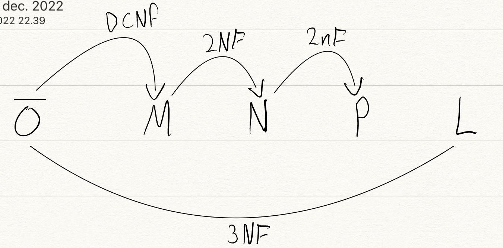
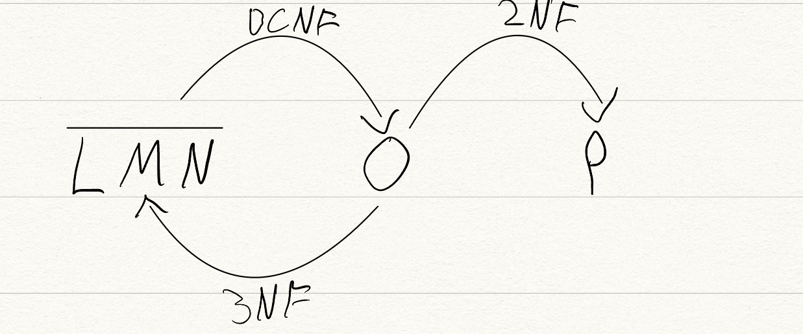
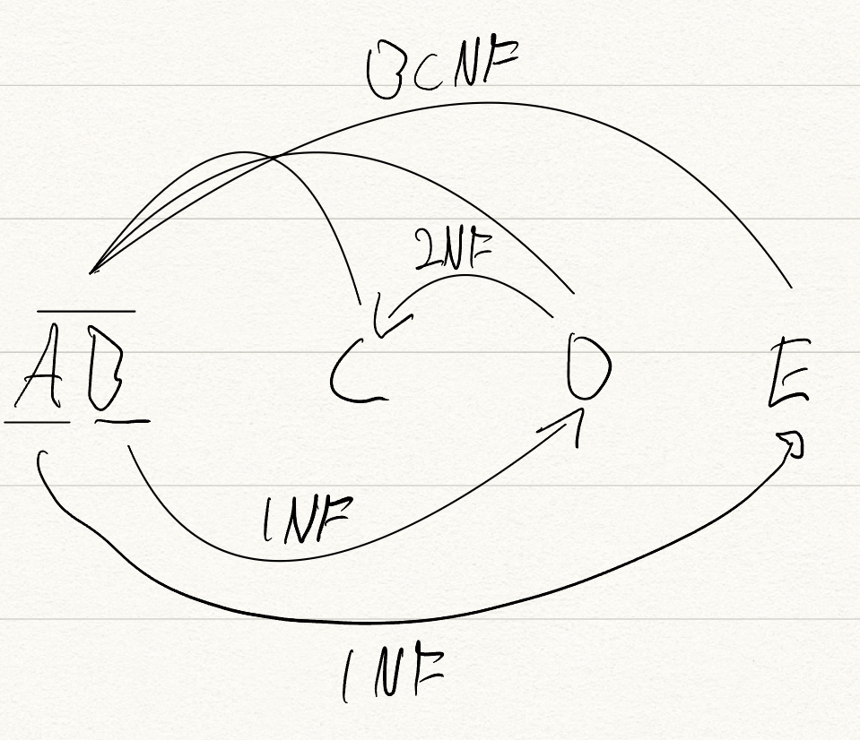
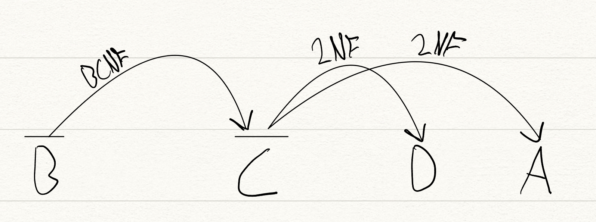
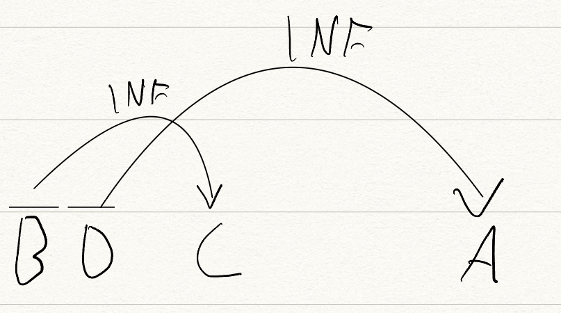
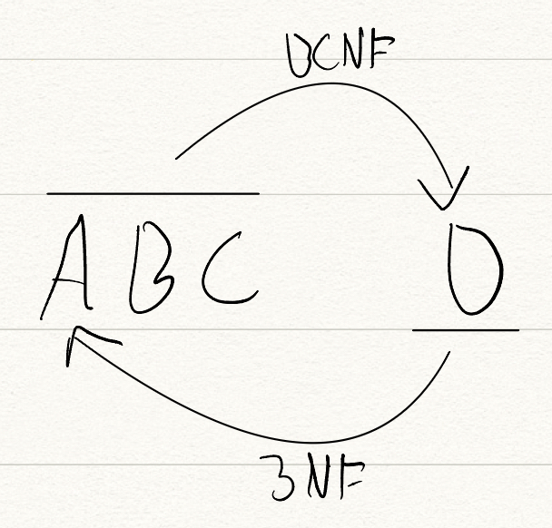
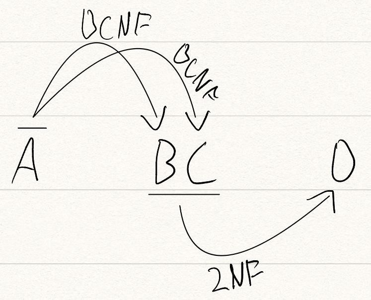
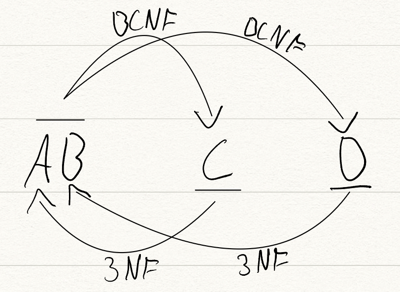

# Normalization

[All Answers](../All_Answers.md)

## August 2022

d) Consider a table R(L,M,N,O, P) with the following dependencies:

L → MNOP

P → MN

O → L

(a) L is the only (candidate) key of R. (−50%)

(b) MN → P is an unavoidable functional dependency. (−50%)

(c) Normalizing to 3NF or BCNF results in exactly two relations. (50%)

(d) The relation can be normalized to BCNF without losing dependencies. (50%)

e) Consider a table R(L,M,N,O, P) with the following dependencies:

LM → N

N → O

O → P

N → L

_Normalize R to the highest possible normal form (3NF or BCNF), based on functional dependencies, while allowing all functional dependencies (excluding trivial, unavoidable, and redundant dependencies) to be checked within a single relation. For each resulting relation, write its columns and clearly indicate whether it is in BCNF._

- LMN in 3NF, NO in BCNF, OP in BCNF.

## Maj 2022

d) Consider a table R(L,M,N,O, P) with the following dependencies:

LMN → OP

O → L

N → P

(a) LMN is the only (candidate) key of R. (−50%)

(b) LMNO → P is an unavoidable functional dependency. (50%)

(c) Normalizing to 3NF or BCNF results in exactly two relations. (50%)

(d) The relation can be normalized to BCNF without losing dependencies. (−50%)

e) Consider a table R(L,M,N,O, P) with the following dependencies:

LMN → OP

LM → O

O → P

_Normalize R to the highest possible normal form (3NF or BCNF), based on functional dependencies, while allowing all functional dependencies (excluding trivial, unavoidable, and redundant dependencies) to be checked within a single relation. For each resulting relation, write its columns and clearly indicate whether it is in BCNF._

- LMN in BCNF, LMO in BCNF, OP in BCNF.

## March 2022

d) Consider a table R(L,M,N,O, P) with the following dependencies:

M → N

O → M

N → P

L → O

(a) M is the only (candidate) key of R. (−50%)

(b) O → N is a redundant functional dependency. (50%)

(c) Normalizing to 3NF or BCNF results in exactly two relations. (−50%)

(d) The relation can be normalized to BCNF without losing dependencies. (50%)

**e) Consider a table R(L,M,N,O, P) with the following dependencies:**

LMN → O

O → MP

_Normalize R to the highest possible normal form (3NF or BCNF), based on functional dependencies, while allowing all functional dependencies (excluding trivial, unavoidable, and redundant dependencies) to be checked within a single relation. For each resulting relation, write its columns and clearly indicate whether it is in BCNF._

- LMNO in 3NF, OP in BCNF.

## December 2021

**d) Consider a table R(L,M,N,O, P) with the following dependencies:**

LMN → OP

L → O

P → M

N → N

Select the true statements:

(a) LMN is the only (candidate) key of R. (−50%)

(b) LMNO → P is an unavoidable functional dependency. (50%)

(c) Normalizing to 3NF or BCNF results in exactly two relations. (50%)

(d) The relation can be normalized to BCNF without losing dependencies. (−50%)

**e) Consider a table R(L,M,N,O, P) with the following dependencies:**

L → MN

N → O

MN → P

_Normalize R to the highest possible normal form (3NF or BCNF), based on functional dependencies, while allowing all functional dependencies (excluding trivial, unavoidable, and derivable dependencies) to be checked within a single relation. For each resulting relation, write its columns and clearly indicate whether it is in BCNF._

- LMN in BCNF (key = L), NO in BCNF (key = N), MNP in BCNF (key = MN).

## June 2021

**4d) Select the true statements:**

R(L,M,N,O,P)

L -> N

N --> P

M --> O

(a) LN is the only (candidate) key of R. (0%)

(b) L --> P is a redundant functional dependency. (50%)

(c) Normalizing to 3NF/BCNF results in exactly two relations. (0%)

(d) The relation can be normalized to BCNF without losing functional dependencies. (50%)

**e) Consider a table R(L;M;N;O; P) with the following dependencies:**

NO --> PLM

M --> M

N --> M

O --> PL

_Normalize R to the highest possible normal form (3NF or BCNF), based on functional dependencies, while allowing all functional dependencies (excluding trivial, unavoidable, and derivable dependencies) to be checked within a single relation. For each resulting relation, write its columns and clearly indicate whether it is in BCNF._

- NO in BCNF (key = NO), NM in BCNF (key = N), OPL in BCNF (key = O).

## August 2021

**d) Consider a table R(L;M;N;O; P) with the following dependencies:**

LM --> NOP

N --> L

O --> P

(a) LM is the only (candidate) key of R. (0%)

(b) LM --> P is a redundant functional dependency. (33:33333%)

(c) Normalizing to 3NF/BCNF results in exactly two relations. (33:33333%)

(d) The relation cannot be normalized to BCNF without losing functional dependencies (excluding trivial, unavoidable, and redundant dependencies). (33:33333%)

**e) Consider a table R(L;M;N;O; P) with the following dependencies:**

LM --> NOP

N --> OP

L --> N

M --> M

_Normalize R to the highest possible normal form (3NF or BCNF), based on functional dependencies, while allowing all functional dependencies (excluding trivial, unavoidable, and derivable dependencies) to be checked within a single relation. For each resulting relation, write its columns and clearly indicate whether it is in BCNF._

- LM in BCNF (key = LM), LN in BCNF (key = L), NOP in BCNF (key = N).

## March 2021

**d) Consider a table R(A;B;C;D;E) with the following dependencies:**

A --> BC

B --> D

C --> E

_(1) Select the true statements:_

(a) A is the only (candidate) key of R. (50%)

(b) AC ! B is a trivial functional dependency. (0%)

(c) Normalizing to 3NF/BCNF results in exactly two relations. (0%)

(d) The relation can be normalized to BCNF without losing functional dependencies (excluding trivial, unavoidable, and derivable dependencies) . (50%)

**e) Consider a table R(A;B;C;D;E) with the following dependencies:**

DE --> ABC

A --> C

B --> D

_Normalize R to the highest possible normal form (3NF or BCNF), based on functional dependencies, while allowing all functional dependencies (excluding trivial, unavoidable, and derivable dependencies) to be checked within a single relation. For each resulting relation, write its columns and clearly indicate whether it is in BCNF._

- AC, in BCNF; ABDE, not in BCNF;

## Januar 2021

**4d) Consider a table R(A, B, C, D, E) with the following dependencies:**

DE → ABC

A → DE

D → B

(a) DE is the only (candidate) key of R. (0%)

(b) AC → B is an unavoidable functional dependency. (50%)

(c) Normalizing to 3NF/BCNF results in exactly two relations. (50%)

(d) The relation cannot be normalized to BCNF without losing functional depen- dencies (excluding trivial, unavoidable, and derivable dependencies) . (0%)

**4e) Consider a table R(A, B, C, D, E) with the following dependencies:**

ABC → DE

C → C

C → D

E → AB

- CD, in BCNF; ABCE, not in BCNF;

## August 2020

**d) Consider a table R(A, B, C, D, E) with the following dependencies:**

AB → CDE

DE → ABC

C → AE

(a) AB is the only (candidate) key of R. **(0%)**

(b) ABC →A is a redundant functional dependency. **(50%)**

(c) Normalizing to 3NF/BCNF results in exactly two relations. **(0%)**

(d) The relation cannot be normalized to BCNF without losing functional dependencies (excluding trivial, unavoidable, and derivable dependencies) . **(50%)**

**e) Consider a table R(A, B, C, D, E) with the following dependencies:**

AB → CDE

C → A

C → D

D → E

**ABC, not in BCNF; CD, in BCNF; DE, in BCNF.**

d) Consider a table R(A;B;C;D;E) with the following dependencies:

A --> CDE

B --> E

B --> A

CD --> E

Select the true statements:

(a) AB is the only (candidate) key of R. (0%)

(b) A ! C is an unavoidable functional dependency. (0%)

(c) Normalizing to 3NF or BCNF results in exactly two relations. (0%)

(d) The relation can be normalized to BCNF without losing functional dependencies (excluding trivial, unavoidable, and derivable dependencies) . (100%)

**e) Consider a table R(A;B;C;D;E) with the following dependencies:**

AB --> CDE

B --> E

C --> A

E --> D

_Normalize R to the highest possible normal form based on functional dependencies (3NF or BCNF), while allowing all functional dependencies (excluding trivial, unavoidable, and derivable dependencies) to be checked within a single relation. Write down the resulting relations and clearly indicate whether they are in BCNF._

- R1(A, B, C) - not in BCNF; R2(B, E) - in BCNF; R3(E, D) - in BCNF

## Maj 2020

d) Consider a table R(A;B;C;D;E) with the following dependencies:

A --> BCDE

ABC --> E

E --> B

CD --> E

(a) A is the only (candidate) key of R. (50%)

(b) ABC ! E is a trivial functional dependency. (0%)

(c) Normalizing to 3NF/BCNF results in exactly two relations. (0%)

(d) The relation can be normalized to BCNF without losing functional dependencies (excluding trivial, unavoidable, and derivable dependencies) . (50%)

e) Consider a table R(A;B;C;D;E) with the following dependencies:

A --> BCDE

B --> A

C --> A

D --> A

_Normalize R to the highest possible normal form (3NF or BCNF), based on functional dependencies, while allowing all functional dependencies (excluding trivial, unavoidable, and derivable dependencies) to be checked within a single relation. For each resulting relation, write its columns and clearly indicate whether it is in BCNF._

- No decomposition, the relation is already in BCNF.

## Maj 2019

**a) Consider a table R(A;B;C;D;E) with the following dependencies:**

AB --> CDE

A --> E

B --> D

D --> C

(a) AB is the only key of R. (50%)

(b) B --> D is an unavoidable functional dependency. (0%)

(c) Normalizing to BCNF results in exactly two relations. (0%)

(d) The relation Z(A;B;C) is in BCNF. (50%)

**b) Consider a table R(A;B;C;D;E) with the following dependencies:**

CD --> AB

ADE --> E

A --> E

AB --> ABCDE

(a) AB is the only key of R. (0%)

(b) ADE --> E is a trivial functional dependency. (33:33333%)

(c) Normalizing to 3NF or BCNF results in exactly two relations. (33:33333%)

**(d) The relation Z(A;B;C;D) is in BCNF. (33:33333%)** (Dont Trust)

c) Consider a table R(A;B;C;D;E) with the following dependencies:

A --> D

DE --> ABC

C --> B

A --> A

## From Exercises

**Exercise 19.7** Suppose you are given a relation R with four attributes ABCD. For each of the following sets of FDs, assuming those are the only dependencies that hold for R, do the following: (a) Identify the candidate key(s) for R. (b) Identify the best normal form that R satisfies (1NF, 2NF, 3NF, or BCNF). (c) If R is not in BCNF, decompose it into a set of BCNF relations that preserve the dependencies.

**1. C→D, C→A, B→C**

(a) Candidate keys: B

(b) R is in 2NF but not 3NF.

(c) C → D and C → A both cause violations of BCNF. One way to obtain a (lossless) join preserving decomposition is to decompose R into AC, BC, and CD.

**2. B→C, D→A**

(a) Candidate keys: BD

(b) R is in 1NF but not 2NF.

(c) Both B → C and D → A cause BCNF violations. The decomposition: AD, BC, BD (obtained by first decomposing to AD, BCD) is BCNF and lossless and join-preserving.

**3. ABC→D, D→A**

(a) Candidate keys: ABC, BCD

(b) R is in 3NF but not BCNF.

(c) ABCDisnotinBCNFsinceD→AandDisnotakey. Howeverifwesplit up R as AD, BCD we cannot preserve the dependency ABC → D. So there is no BCNF decomposition.

**4. A→B,BC→D,A→C**

(a) Candidate keys: A

(b) R is in 2NF but not 3NF(becauseoftheFD:BC→D).

(c) BC → D violates BCNF since BC does not contain a key. So we split up R as in: BCD, ABC.

**5. AB→C, AB→D, C→A, D→B**

(a) Candidate keys: AB, BC, CD, AD

(b) R is in 3NF but not BCNF (because of the FD: C→A and D→B).

(c) C → A and D → B both cause violations. So decompose into: AC, BCD but this does not preserve AB → C and AB → D, and BCD is still not BCNF because D → B. So we need to decompose further into: AC, BD, CD. However, when we attempt to revive the lost functioanl dependencies by adding ABC and ABD, we that these relations are not in BCNF form. Therefore, there is no BCNF decomposition.

## March 2019

c) Consider a table R(A;B;C;D;E) with the following dependencies:

AB --> C

DE --> E

C --> DE

A --> C

Normalize R to BCNF and write down the resulting relations here:

- R1(A, B), R2(A, C), R3(C, D, E)
