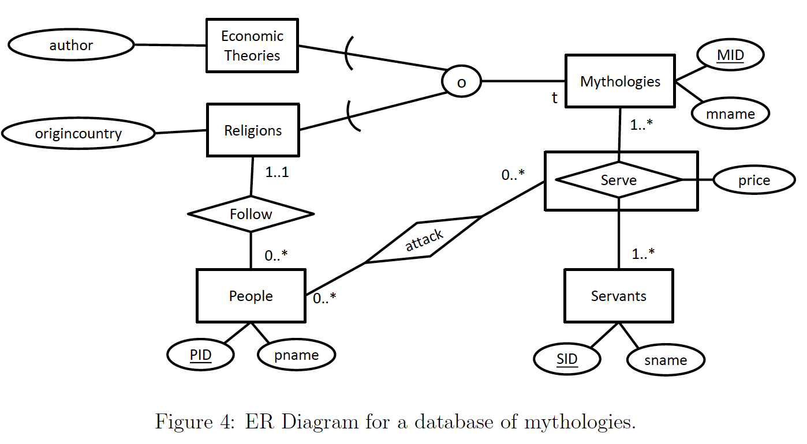

# Reading And DDL, ER-diagrams

[All Answers](../All_Answers.md)

## August 2022


(a) All worlds are connected to at least one other world. (−33.33333%)

(b) A world may be connected to itself. (33.33333%)

(c) A wormhole may exist that does not enable a connection between worlds. (33.33333%)

(d) A wormhole may enable the connection of more than two worlds. (−33.33333%)

(e) All worlds connect to at least one god through some relationships. (−33.33333%)

(f) All gods have created some wormhole. (33.33333%)

**4b) Write your DDL for creating the database.**

```sql
drop table if exists connect cascade;
drop table if exists friends cascade;
drop table if exists worlds cascade;
drop table if exists gods cascade;
drop table if exists superheros cascade;
drop table if exists worlds cascade;

create table gods (
	gid integer primary key,
	gname varchar not null
);

create table wormholes (
	hid integer primary key,
	hname varchar not null,
	gid integer not null references gods(gid)
);

create table worlds (
	wid integer primary key,
	wname varchar not null
);

create table connect (
	wid1 integer references worlds(wid),
	wid2 integer references worlds(wid),
	hid integer references wormholes(hid),
	primary key (wid1, wid2),
	unique (hid)
);

create table superheros (
	sid integer primary key,
	sname varchar not null,
	wid integer not null references worlds(wid)
);

create table friends (
	sid integer references superheros(sid),
	gid integer references gods(gid),
	primary key (sid, gid)
);
```

## Maj 2022



(a) All people are connected to at least one servant through the relationships. (33.33333%)

(b) A servant may serve no mythology. (−33.33333%)

(c) An economic theory must be served by some servant. (33.33333%)

(d) An economic theory can also be a religion. (33.33333%)

(e) People can only follow religions that are not also economic theories. (−33.33333%)

(f) No person (people entity) can attack any servant that serves the religion that the person follows. (−33.33333%)

**4b) Write your DDL for creating the database. You can also write any extra assumptions, attributes or explanations you feel are necessary.**

```sql
create table Mythologies (
	MID int primary key,
	mname varchar not null
);

create table EconomicTheories (
	MID int primary key references Mythologies(MID),
	author varchar not null
);

create table Religions (
	MID int primary key references Mythologies(MID),
	origincountry varchar not null
);

create table Servants (
	SID int primary key,
	sname varchar not null,
);

create table People (
	PID int primary key,
	pname varchar not null

	-- Follow relationship
	MID int not null references Religions(MID)
);

-- Choosing option 1 here
create table Serve (
	MID int not null references Mythologies (MID),
	SID int not null references Servants (SID),
	price int not null,
	primary key (MID, SID)
);

create table Attack (
	PID int references People (PID),
	MID int,
	SID int,
	primary key (PID, MID, SID),
	foreign key (MID, SID) references Serve (MID, SID)
);
```

## March 2022


(a) All Jojos connect to at least one Loner through some relationships. (−33.33333%)

(b) All Loners connect to at least one Home through some relationships. (33.33333%)

(c) All Homes connect to at least one Loner through some relationships. (−33.33333%)

(d) Some Loner may be connected to itself through some relationships. (33.33333%)

(e) Some Home may be connected to itself through some relationships. (33.33333%)

(f) All Jojos must be connected to themselves through some relationships. (−33.33333%)

## December 2021


**a) The ER diagram in Figure 4 shows a simple database for bicycle races. Select the true statements. You should base your answers only on the ER diagram:**

(a) A racer has competed in at most 1 tour. (−33.33333%)

(b) A racer has competed in at least 1 tour. (33.33333%)

(c) Many stretches can have the same name. (33.33333%)

(d) Many racers can have the same name. (33.33333%)

(e) Each stretch connects to at least one racer, via the relationships. (−33.33333%)

(f) All cities are the start of some leg. (−33.33333%)

**b) Write SQL DDL commands to create a bicycle race database based on the ER diagram in Figure 4. The DDL script must run in PostgreSQL as a whole. The relations must include all primary key and foreign key constraints. Constraints that cannot be enforced with standard primary key and foreign key constraints can be omitted. The type of name attributes should be string, all other attributes should be int.**

```sql
create table tours (
	TID int primary key,
	name varchar not null
);

create table cities (
	CID int primary key,
	name varchar not null
);

create table racers (
	RID int primary key,
	name varchar not null
);

create table legs (
	LID int primary key,
	name varchar not null,
	end_at int not null references cities(CID),
	-- Here, the null constraint is important
	start_at int null references cities(CID)
);

create table stretches (
	LID int references legs(LID),
	name varchar not null,
	primary key (LID, name)
);

create table consist_of (
	TID int references tours(TID),
	LID int references legs(LID),
	sequence int not null,
	primary key (TID, LID)
);

create table race_in (
	TID int references tours(TID),
	LID int references legs(LID),
	RID int references racers(RID),
	rank int not null,
	primary key (TId, LID, RID),
	-- Here, the correct foreign key is important
	foreign key (TID, LID) references consist_of(TID, LID)
);
```

## June 2021


**a) The ER diagram in Figure 4 shows an abstract database design. Select the statements that are deffinitely true for any database instance, based only on the ER diagram:**

(a) Each E1 entity is connected through relationships to at least one E5 entity. (33:33333%)

(b) Each E1 entity is connected through relationships to at least one E2 entity. (33:33333%)

(c) Each E3 entity is connected through relationships to at most one E5 entity. (0%)

(d) Each E3 entity is connected through relationships to at most one E2 entity. (33:33333%)

(e) E3 is a weak entity. (0%)

(f) The number of columns in the table for R2 will depend on whether option 1 or option 2 is chosen for implementing aggregation. (0%)

b) Write SQL DDL commands to create a database based on the ER diagram in Figure 4 using the methodology given in the textbook and lectures. The DDL script must run in PostgreSQL as a whole. The relations must include all relevant primary key, candidate key, foreign key and NOT NULL constraints. Constraints that cannot be enforced with these standard constraints should be omitted. Attributes should be of type INTEGER.

```sql
create table E2 (
	E2ID int primary key
);

create table E1 (
	E1ID int primary key,
	E2ID int not null references E2(E2ID)
);

create table E3 (
	E3ID int primary key,
	E1ID int not null references E1(E1ID)
);

create table E4 (
	E4ID int primary key
);

create table E5 (
	E5ID int primary key
);


-- Note:
-- Normally, the relationship R3 could also be implemented as a NULL-able E5ID attribute in E4
-- In this case, however, the R2 relationship calls for a separate table
create table R3 (
	E4ID int primary key references E4(E4ID),
	E5ID int not null references E5(E5ID)
);

create table R2 (
	E1ID int references E1(E1ID),
	E4ID int references R3(E4ID),
	primary key (E1ID, E4ID)
);
```

## August 2021


**a) The ER diagram in Figure 4 shows a database design for a tutoring database. Select the statements that are de nitely true for any database instance, based only on the ER diagram:**

(a) Each teacher is connected through relationships to at least one lecture. (0%)

(b) Each teacher is connected through relationships to at least one censor. (0%)

(c) Each student is connected through relationships to at most one censor. (25%)

(d) Each student is connected through relationships to at least one censor. (25%)

(e) Each student may be connected multiple times to the same teacher. (25%)

(f) Each censor may be connected multiple times to the same teacher. (25%)

**4b) Write your DDL for creating the database. You can also write any extra assumptions, attributes or explanations you feel are necessary.**

```sql
create table teachers (
	TID int primary key,
	name varchar not null
);

create table students (
	SID int primary key,
	name varchar not null
);

create table lectures (
	LID int primary key,
	name varchar not null
);

create table censors (
	CID int primary key,
	name varchar not null
);

create table tutor (
	TID int not null references teachers(TID),
	SID int references students(SID),
	fromyear int,
	CID int not null references censors(CID),
	primary key (SID, fromyear)
);

create table attend (
	SID int references students(SID),
	LID int references lectures(LID),
	primary key (SID, LID)
);
```

## March 2021


**a) The ER diagram in Figure 4 shows a database for a (poorly designed) university application. Select the statements that are de nitely true for any database instance, based only on the ER diagram:**

(a) Multiple students can take the same course in the same semester. (0%)

(b) Students must take at least one course in the term that they start in. (0%)

(c) Students must have at least one grade. (0%)

(d) Students can get multiple grades in the same course in the same semester. (50%)

(e) For a course given in a semester, at least one student must take the course. (50%)

(f) Each examiner must grade at least one student. (0%)

**4b) Write your DDL for creating the database. You can also write any extra assumptions, attributes or explanations you feel are necessary.**

```sql
drop table if exists Grades;
drop table if exists Takes;
drop table if exists Examiner;
drop table if exists Course;
drop table if exists Term;
drop table if exists Student;

create table Term (
	TID integer primary key,
	_desc varchar not null
);

create table Student (
	SID integer primary key,
	startsin integer not null references Term(TID)
);

create table Course (
	CID integer primary key
);

create table Examiner (
	EID integer primary key
);

create table Takes (
	-- using option 2
	TakesID integer primary key,
	SID integer not null references Student(SID),
	CID integer not null references Course(CID),
	TID integer not null references Term(TID),
	room varchar not null,
	unique (TID, CID) -- since Student is 1..1
);

create table Grades (
	TakesID integer references Takes(TakesID),
	EID integer references Examiner(EID),
	grade integer not null,
	primary key (TakesID, EID)
);
```

## Januar 2021


**4a) Select the true statements:**

(a) Every Person is a Taxpayer. (0%)

(b) Every Adult is a Taxpayer. (33.33333%)

(c) Each Company must get payments from the same Adult for all its sales. (0%)

(d) Each Company must get payments from different Adults for all its sales. (0%)

(e) One Taxpayer cannot be both a Company and an Adult. (33.33333%)

(f) One Person cannot be both an Adult and a Child. (33.33333%)

**4b) Write your DDL for creating the database. You can also write any extra assump- tions, attributes or explanations you feel are necessary.**

```sql
drop table if exists SellsTo;
drop table if exists Adult;
drop table if exists Child;
drop table if exists Company;
drop table if exists Person;
drop table if exists Taxpayer;

create table Taxpayer (
	TID integer primary key
);

create table Person (
	PID integer primary key
);

create table Adult (
	PID integer primary key references Person(PID),
	role varchar not null,
	TID integer not null references Taxpayer(TID)
);

create table Child (
	PID integer primary key references Person(PID),
	age int not null
);

create table Company (
	CID integer primary key,
	TID integer not null references Taxpayer(TID)
);

create table SellsTo (
	CID integer references Company(CID),
	PID integer references Child(PID),
	day date,
	price int not null,
	paysForID int not null references Adult(PID),
	primary key (CID, PID, day)
);
```

## August 2020


**4a) ER Diagram Interpretation, Select the true statements:**

(a) Every client is related to exactly one manager via the audits relationship. **(0%)**

(b) Every client is related to exactly one manager when the audits relationship is excluded. **(33.33333%)**

(c) Every manager is related to exactly one client when the audits relationship is excluded. **(0%)**

(d) Managers might also be clients. **(33.33333%)**

(e) If a shrink is hired by a new office, information about old hirings disappears. **(33.33333%)**

(f) Managers cannot audit treatment of clients in their own offices. **(0%)**

4b) Write your DDL for creating the database. You can also write any extra assumptions, attributes or explanations you feel are necessary.

```sql
drop table if exists Audit;
drop table if exists Client;
drop table if exists Shrink;
drop table if exists Office;
drop table if exists Manager;

create table Manager (
	MID integer primary key
);

create table Office (
	OID integer primary key,
	MID integer not null references Manager
);

create table Shrink (
	SID integer primary key,
	OID integer not null references Office,
	since date not null
);

create table Client (
	CID integer primary key,
	SID integer not null references Shrink
);

create table Audit (
	CID integer references Client,
	MID integer references Manager,
	primary key (CID, MID)
);
```

## April 2020


(a) Every cure is reviewed by exactly one doctor via an audit. (50%)

(b) A doctor may review his/her own cure via an audit. (50%)

(c) Every doctor reviews at least one audit. (0%)

(d) Each doctor is connected to at least one auditing company via the Cure and Audit relationships. (0%)

(e) Each patient is connected to exactly one auditing company via the Cure and Audit relationships. (0%)

(f) An account holder can be both a doctor and an auditing company. (0%)

**b) Write SQL DDL commands to create a medical facility database based on the ER diagram in Figure 2 using the methodology given in the textbook and lectures. The DDL script must run in PostgreSQL. The relations must include all relevant primary key, candidate key, foreign key and NOT NULL constraints. Constraints that cannot be enforced with these standard constraints should be omitted. All attributes should be of type INTEGER or SERIAL.**

```sql
drop table if exists Cure;
drop table if exists Patient;
drop table if exists Doctor;
drop table if exists AuditingCompany;
drop table if exists AccountHolder;

-- entity tables

create table Patient (
	PID serial primary key
);

create table AccountHolder (
	AHID serial primary key
);

create table Doctor (
	D ID serial primary key,
	AHID integer not null references AccountHolder (AHID)
);

create table AuditingCompany (
	AID serial primary key,
	AHID integer not null references AccountHolder (AHID)
);

-- relationship table (only 1 due to 1..1 constraints)

create table Cure (
	PID integer references Patient (PID),
	DID integer references Doctor (DID),
	-- This is the 1..1 Audit relationship
	AID integer not null references AuditingCompany (AID),
	-- This is the 1..1 Review relationship
	RID integer not null references Doctor (DID),
	primary key (PID, DID)
);
```

## Maj 2020


(a) Every programmer has mastered at least one skill. (0%)

(b) Every Yoda has mastered at least one skill. (50%)

(c) Every Anakin is connected to at least one skill via some relationship(s). (50%)

(d) Every Anakin is connected to at least on mantra via some relationship(s). (0%)

(e) Anakins can only observe their Yoda trainer mastering skills. (0%)

(f) No two Yodas can have the same mantra. (0%)

_Notes: In (e) it was unclear whether this question only applied to the Observes relationship, or to Anakins in general. In either case, however, the correct answer would be FALSE. In (f), the question can either be understood to refer to the actual mantra (text), in which case the answer would be FALSE, or it can be understood to refer to the weak entity, in which case the answer would be TRUE. As a result, item (f) was omitted from grading._

**b) Write SQL DDL commands to create a programmer training facility database based on the ER diagram in Figure 4 using the methodology given in the textbook and lectures. The DDL script must run in PostgreSQL. The relations must include all relevant primary key, candidate key, foreign key and NOT NULL constraints. Constraints that cannot be enforced with these standard constraints should be omitted. All attributes should be of type INTEGER except Mantra, which should be of type VARCHAR.**

```sql
drop table if exists observes;
drop table if exists masters;
drop table if exists mantras;
drop table if exists anakins;
drop table if exists yodas;
drop table if exists programmers;
drop table if exists skills;

create table programmers (
	PID integer primary key
);

create table yodas (
	PID integer primary key references programmers,
	JediLevel integer not null
);

create table anakins (
	PID integer primary key references programmers,
	trainer integer not null references yodas(PID),
	AngerLevel integer not null
);

create table mantras (
	PID integer references yodas,
	mantra varchar,
	primary key (PID, mantra)
);

create table skills (
	SID integer primary key
);

create table masters (
	SID integer references skills,
	PID integer references yodas,
	SkillLevel integer not null,
	primary key (SID, PID)
);

create table observes (
	SID integer,
	YPID integer,
	APID integer references anakins(PID),
	foreign key (SID, YPID) references masters (SID, PID),
	primary key (SID, YPID, APID)
);
```
