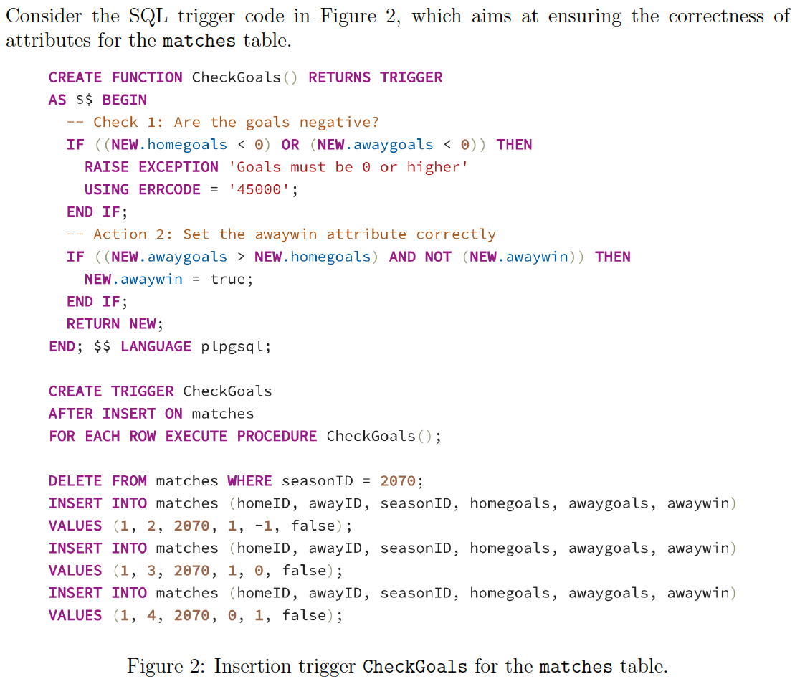
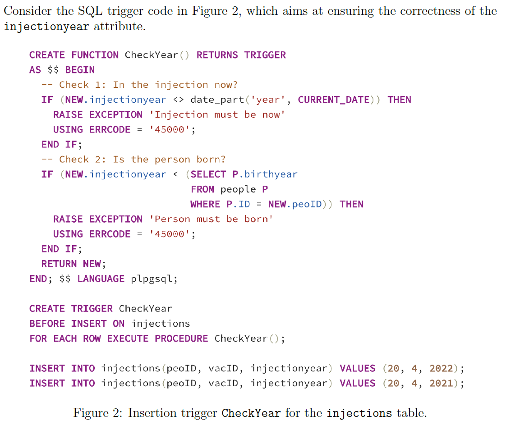
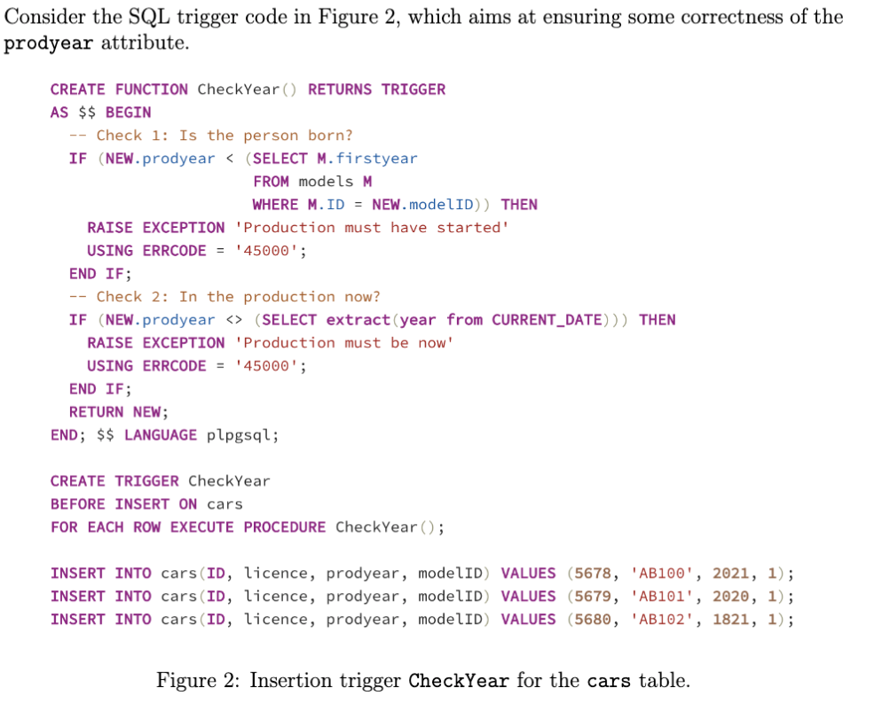
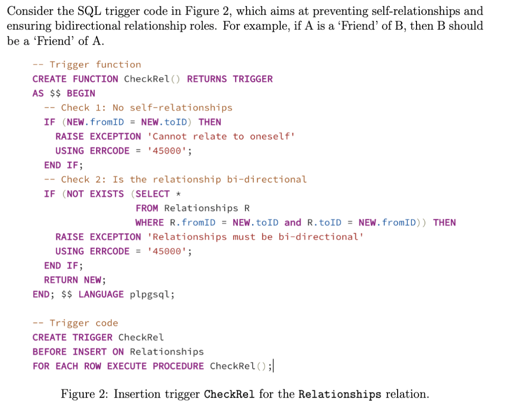
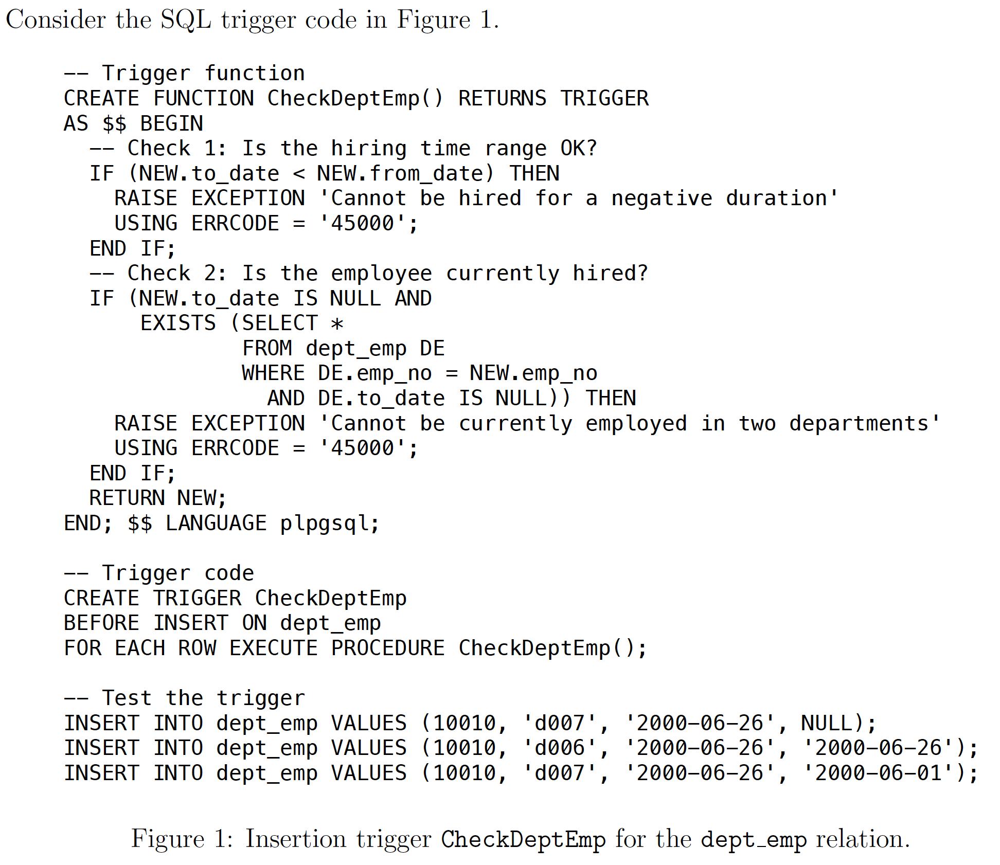
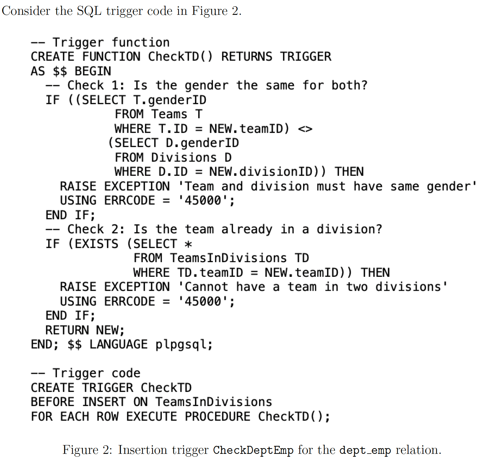

# Sql Programming

[All Answers](../All_Answers.md)

## August 2022

(a) Check 1 can be replaced by a CHECK constraint on the BasicService relation. (33.33333%)

(b) Check 2 can be replaced by a CHECK constraint on the BasicService relation. (−50%)

(c) The first UPDATE statement will give an error. (33.33333%)

(d) The second UPDATE statement will give an error. (−50%)

(e) The third UPDATE statement will give an error. (33.33333%)

## Maj 2022

(a) Check 1 can be replaced by a CHECK constraint on the Audits relation. (50%)

(b) Check 2 can be replaced by a CHECK constraint on the Audits relation. (−50%)

(c) The second INSERT statement will raise an error. (50%)

(d) The fourth INSERT statement will raise an error. (−50%)

## March 2022

(a) The trigger is incorrectly implemented as an ‘AFTER’ trigger. (−50%)

(b) The INSERT statement will succeed in adding a row to the LogExtremeTests relation. (50%)

(c) The data in the LogExtremeTests relation is sufficient to allow a competent SQL programmer to find the variant detected and the kit used. (50%)

(d) As this is an AFTER trigger, adding code that rejects tests based on data values (e.g., because they are older than one week) would not work. (−50%)

## December 2021

(a) The trigger prevents negative quantity values from entering the relation. (−33.33333%) _Because it is an after and not a before trigger_

(b) The trigger ensures that only ingredients that belong to the same cuisine as the recipe can be used. (50%)

(c) The first INSERT will succeed in adding a row to the table. (50%)

(d) The second INSERT will succeed in adding a row to the table. (−33.33333%)

(e) The third INSERT will succeed in adding a row to the table. (−33.33333%)

## August 2021

(a) Check 1 can be replaced by a CHECK constraint on the plantedin table. (33:33333%)

(b) Check 2 can be replaced by a CHECK constraint on the plantedin table. (0%)

(c) The  rst INSERT statement will fail. (33:33333%)

(d) The second INSERT statement will fail. (0%)

(e) The third INSERT statement will fail. (33:33333%)

## June 2021

(a) Check 1 can be replaced by CHECK constraints on the matches table. (33:33333%)

(b) This trigger is correctly written as an AFTER trigger. (0%)

(c) The  rst INSERT statement will fail. (33:33333%)

(d) The second INSERT statement will succeed. (33:33333%)

(e) The third INSERT statement will succeed, and the inserted row will correctly have the awaywin attribute changed to true. (0%)

## March 2021

(a) Check 1 can be replaced by a CHECK constraint on the injections table. (33:33333%)

(b) Check 2 can be replaced by a CHECK constraint on the injections table. (0%)

(c) This trigger is more effcient as a BEFORE trigger than an AFTER trigger. (33:33333%)

(d) The  first INSERT statement will succeed (at the time of the exam). (0%)

(e) The second INSERT statement will succeed (at the time of the exam). (33:33333%)

## Januar 2021

(a) Check 1 can be replaced by a CHECK constraint on the cars table. (0%)

(b) Creating the trigger for the given database instance will fail because there are already cars that were made before the model started. (0%)

(c) The first INSERT statement will fail Check 2 (at the time of the exam). (0%)

(d) The second INSERT statement will succeed, because the given database instance does not have a car with licence AB101. (0%)

(e) The third INSERT statement will fail Check 1. (100%)

## August 2020

(a) Check 1 can be replaced by a CHECK constraint on the Relationships relation. **(33.33333%)**</u>

(b) Check 2 can be replaced by a CHECK constraint on the Relationships relation. **(0%)**

(c) Creating the trigger for the given database instance will fail because there are already relationships that are not bi-directional. **(0%)**

(d) Adding relationships for new users will always fail. **(33.33333%)**

(e) The trigger is not defined for the correct table to achieve its goal of ensuring bidirectional relationships. **(33.33333%)**

## April 2020

**a) Select the true statements:**

(a) Check 1 can be replaced by a CHECK constraint on the dept emp relation. (100%)

(b) Check 2 can be replaced by a CHECK constraint on the dept emp relation. (0%)

**b) Based on the dept emp relation instance installed by the database installation script (you can use queries to check the relation instance for employee 10010), which INSERT statements will give an error (note that more than one of the statements may give an error):**

(a) The  first INSERT statement will give an error. (33:33333%)

(b) The second INSERT statement will give an error. (33:33333%)

(c) The third INSERT statement will give an error. (33:33333%)

## Maj 2020

(a) Check 1 can be replaced by a constraint on the TeamsInDivisions relation. (0%)

(b) Check 2 can be replaced by a constraint on the TeamsInDivisions relation. (50%)

(c) Creating the trigger will fail because teams are already incorrectly registered to divisions. (0%)

(d) Creating the trigger will not correct the data in the relation. (50%)

(e) The trigger would also work correctly as an AFTER trigger. (0%)
